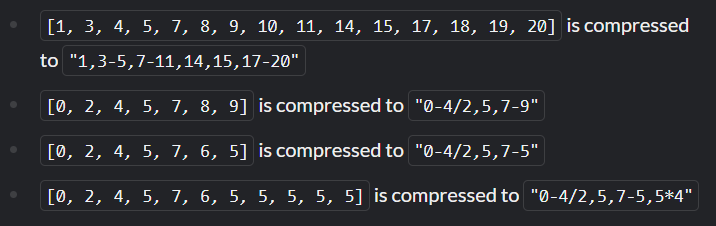

You have been hired by a major MP3 player manufacturer to implement a new music compression standard. In this kata you will implement the ENCODER, and its companion kata deals with the DECODER. It can be considered a harder version of Range Extraction.

Specification
The input signal is represented as an array of integers. Several cases of regularities can be shortened.

A sequence of 2 or more identical numbers is shortened as number*count
A sequence of 3 or more consecutive numbers is shortened as first-last. This is true for both ascending and descending order
A sequence of 3 or more numbers with the same interval is shortened as first-last/interval. Note that the interval does NOT need a sign
Compression happens left to right

Examples

Input
A non-empty array of integers

Output
A string of comma-separated integers and sequence descriptors

